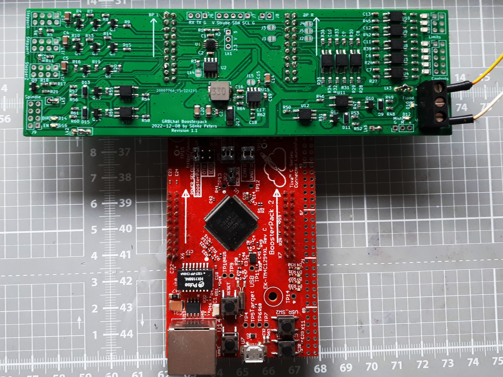

# grblHAL BoosterWing

A breakout board for the Texas Instruments EK-TM4C1294XL Launchpad running the [grblHAL TM4C1294](https://github.com/grblHAL/TM4C1294) firmware by [Terje Io](https://github.com/terjeio).

This is a Frankenstein style child of [GRBLHAL2000](https://github.com/Expatria-Technologies/grblhal_2000_PrintNC) and 
[CNC_Boosterpack](https://github.com/terjeio/CNC_Boosterpack).

There were two objectives for this:
  1. follow known-working proven schematics - no questions asked
  2. keep it manufacturable by JLCPCB with the least costs for extended parts

